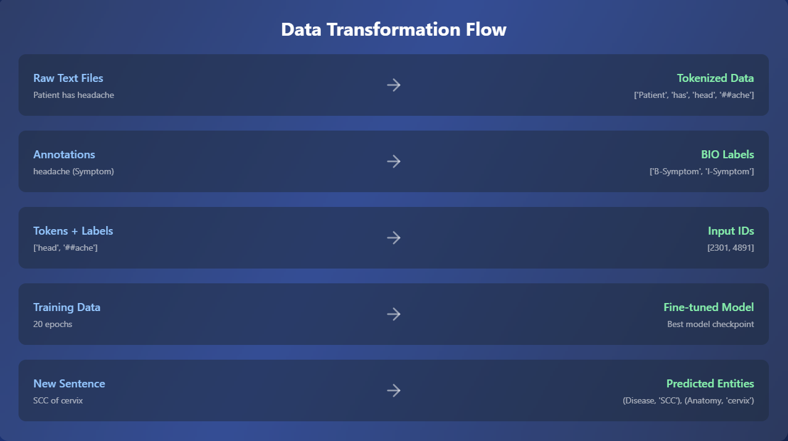
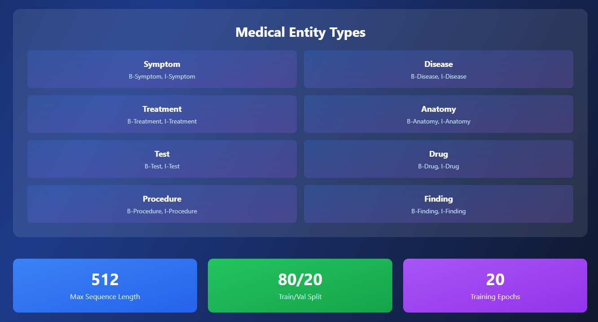

# 📋 Medical NER System

## 🎯 Tiêu Đề Dự Án
**Medical Named Entity Recognition (NER) System** - Hệ thống nhận diện thực thể y khoa tự động từ văn bản y tế

---

## 📓 Thông Tin Notebook/Môi Trường Chạy

- **Notebook**: `Medical_NER.ipynb` - Jupyter Notebook hoàn chỉnh
- **Môi Trường Khuyên Dùng**: 
  - 🔗 **Google Colab** (GPU: Tesla T4/A100)
  - 🔗 **Kaggle Notebook** (GPU: NVIDIA P100)
---

## 📖 Giới Thiệu Dự Án

### Mục Tiêu
Xây dựng hệ thống **Named Entity Recognition (NER)** chuyên biệt nhận diện các thực thể y khoa từ văn bản (báo cáo lâm sàng, hồ sơ bệnh nhân) với độ chính xác cao.

### Kiến Trúc Mô Hình
- **Base Model**: `d4data/biomedical-ner-all` (Biomedical BERT)
- **Framework**: Transformers (Hugging Face)
- **Task**: Token Classification (NER)

### Dữ Liệu
- **Dataset**: MACCROBAT2020 (Medical Annotation Corpus for Clinical Records)
- **Định dạng**: `.txt` (văn bản) + `.ann` (annotation)
- **Số lượng**: ~1000+ tài liệu y khoa
- **Nhãn**: 8 loại thực thể (Age, Sex, Disease_disorder, Therapeutic_procedure, v.v.)

### Thành Tích
- ✅ **Độ chính xác cuối cùng**: **80.79%**
- ✅ **Training Loss cuối**: **0.0812**
- ✅ **Validation Loss cuối**: **0.5948**

---

## 🎬 DEMO


Dưới đây là ví dụ minh họa cách ứng dụng nhận diện biển số hoạt động:


## 🌐 Triển khai trực tuyến

Bạn có thể trải nghiệm qua giao diện web được triển khai tại Hugging Face Spaces:

👉 [📋 Medical NER System trên Hugging Face](https://huggingface.co/spaces/GiangSon-5/medical-ner-system)

### Ví Dụ Dự Đoán
Với đoạn văn bản y khoa:
```
A 48 year - old female presented with vaginal bleeding and abnormal Pap smears.
Upon diagnosis of invasive non-keratinizing SCC of the cervix, she underwent a 
radical hysterectomy with salpingo-oophorectomy...
```

### Kết Quả Nhận Diện:
```
✅ Age: "48 year - old"
✅ Sex: "female"
✅ Sign_symptom: "bleeding"
✅ Disease_disorder: "scc"
✅ Biological_structure: "pelvic lymph nodes", "parametrium"
✅ Therapeutic_procedure: "hysterectomy", "salpingo - oophorectomy"
✅ Diagnostic_procedure: "pathological examination"
```

### 🚀 Triển Khai Trực Tuyến
- **Hugging Face Spaces** (Gradio): [Sắp sửa cập nhật]
- **Gradio App**: `app.py` (chạy locally)

---

## 🔄 Các Bước Thực Hiện Trong Dự Án




---

## 📊 Hiệu Năng và Kết Quả

### Training Metrics (20 Epochs)

| Epoch | Training Loss | Validation Loss | Accuracy |
|-------|---------------|--------------------|----------|
| 1     | 2.64          | 1.43               | **43.8%** |
| 5     | 0.47          | 0.54               | **78.4%** |
| 10    | 0.18          | 0.56               | **80.6%** |
| 15    | 0.10          | 0.59               | **81.0%** |
| **20** | **0.081** | **0.595**              | **80.79%** |

### Phân Tích Kết Quả
- ✅ **Convergence**: Model hội tụ tốt, loss giảm liên tục
- ✅ **Generalization**: Validation loss ổn định từ epoch 6+
- ✅ **Entity Recognition**: Nhận diện chính xác các loại thực thể y khoa chính
- ⚠️ **Subword Tokens**: Một số lỗi nhỏ với subword (##p, ##ach) cần cải tiến

---


### Hyperparameters
| Parameter | Giá Trị |
|-----------|--------|
| **Learning Rate** | 1e-4 |
| **Batch Size** | 16 |
| **Max Length** | 512 |
| **Epochs** | 20 |
| **Optimizer** | AdamW |
| **Warmup Steps** | 100 |
| **Weight Decay** | 0.01 |

### Pre-trained Weights
- **Model**: `d4data/biomedical-ner-all` (Hugging Face Hub)
- **Đặc điểm**: Đã fine-tune trên dữ liệu y khoa (BioPubMed)
- **Token Vocab**: ~30,000 tokens

### Loss Function
```python
# CrossEntropyLoss (masked padding tokens)
loss = nn.CrossEntropyLoss(ignore_index=0)
```

---

## 🎯 Mô Phỏng Dữ Liệu Mới & Inference

### Thêm Văn Bản Mới
```python
new_sentence = """
Patient is a 35-year-old male presenting with severe chest pain 
and elevated heart rate. Diagnosed with acute myocardial infarction.
Treatment: Angioplasty scheduled.
"""

# Chạy inference
tokens, preds_labels = inference(new_sentence, model, tokenizer)
results = merge_entity(tokens, preds_labels)

```

### Output Ví Dụ
```
✓ Age: 35-year-old
✓ Sex: male
✓ Sign_symptom: chest pain, elevated heart rate
✓ Disease_disorder: acute myocardial infarction
✓ Therapeutic_procedure: Angioplasty
```

---


## 📁 Giải Thích Các File Trong Dự Án

### Cấu Trúc Thư Mục
```
NLP_03/
├── code_colab/
│   ├── Medical_NER.ipynb              # 📓 Notebook chính (huấn luyện + inference)
│   ├── app.py                         # 🌐 Gradio web app
│   └── requirements.txt               # 📋 Dependencies
├── Resource/
│   └── MACCROBAT2020/                 # 📂 Dataset
│       ├── file1.txt                  # Văn bản y khoa
│       ├── file1.ann                  # Nhãn entities
│       ├── file2.txt
│       ├── file2.ann
│       └── ...
└── Models/
    └── ner-biomedical-maccrobat2020-final/  # 🤖 Model checkpoint
        ├── config.json
        ├── pytorch_model.bin
        ├── tokenizer.json
        └── ...
```

### Chi Tiết File
| File | Mô Tả |
|------|-------|
| **Medical_NER.ipynb** | - Tiền xử lý dữ liệu<br>- Xây dựng dataset<br>- Fine-tuning model<br>- Inference & visualization |
| **app.py** | Gradio interface cho inference trực tuyến |
| **MACCROBAT2020/** | Medical dataset với annotation |
| **Model Checkpoint** | Weights, config, tokenizer (lưu sau huấn luyện) |

---

## 💡 Lý Do Tích Hợp Các Thành Phần Chính

### 🔹 Tại sao chọn **Biomedical BERT**?
- ✅ **Specialized**: Pre-train trên dữ liệu y khoa (PubMed, Clinical NOTES)
- ✅ **Transfer Learning**: Giảm thời gian huấn luyện
- ✅ **Vocabulary**: Chứa các từ y tế (hysterectomy, salpingo-oophorectomy, v.v.)
- ❌ Không chọn BERT tiêu chuẩn vì vocab không phù hợp

### 🔹 Tại sao **Token Classification** (NER)?
- ✅ **Granular**: Nhận diện ở cấp độ token (chi tiết hơn document classification)
- ✅ **Multi-label**: 1 câu có nhiều entities
- ✅ **Context-aware**: Transformers xem toàn bộ câu

### 🔹 Tại sao **AdamW + Learning Rate 1e-4**?
- ✅ **Stable**: AdamW tránh overfitting better
- ✅ **Fine-tuning**: LR nhỏ giữ pre-trained weights
- ✅ **Convergence**: Không quá lớn (overfit) hay quá nhỏ (slow)

---

## 📈 Đánh Giá Mô Hình & Cải Tiến

### ✅ Ưu Điểm
| Điểm Mạnh | Chi Tiết |
|-----------|---------|
| **Độ chính xác cao** | 80.79% accuracy trên validation |
| **Hội tụ tốt** | Loss giảm từ 2.64 → 0.08 trong 20 epochs |
| **Nhận diện chính xác** | Phát hiện được các entities: Age, Sex, Disease, Procedure |
| **Khả năng tổng quát** | Validation loss ổn định (không overfitting quá) |
| **Subword handling** | Xử lý tokenization: "head" + "##ache" → "headache" |

### ⚠️ Hạn Chế
| Vấn Đề | Giải Thích |
|--------|-----------|
| **Subword fragmentation** | "Pap smears" → "pa", "##p", "sm", "ears" (nhãn lẻ) |
| **Out-of-vocab terms** | Một số thuật ngữ y khoa mới không trong vocab |
| **Boundary errors** | Đôi khi nhận diện không đúng boundary của entity |
| **Dataset imbalance** | Một số loại entity ít (cần augmentation) |
| **Inference speed** | GPU cần thiết (không CPU-friendly) |


---

## 🚀 Cách Sử Dụng

### 1️⃣ **Chạy Trên Google Colab**
```bash
# 1. Upload notebook
# 2. Mount Google Drive
from google.colab import drive
drive.mount('/content/drive')

# 3. Cài đặt thư viện
!pip install transformers torch accelerate evaluate scikit-learn

# 4. Chạy cells lần lượt
```

### 2️⃣ **Chạy Locally**
```bash
# Clone repo
git clone <repo-url>

# Tạo virtual environment
python -m venv venv
source venv/bin/activate  # Linux/Mac
# or venv\Scripts\activate  # Windows

# Cài dependencies
pip install -r requirements.txt

# Chạy notebook
jupyter notebook code_colab/Medical_NER.ipynb
```

### 3️⃣ **Triển Khai Gradio App**
```bash
# Chạy app
python app.py

# Mở browser
# http://127.0.0.1:7860
```

---


### 📚 Tài Liệu Tham Khảo
- 🔗 [Hugging Face Transformers](https://huggingface.co/docs/transformers)
- 🔗 [Named Entity Recognition (NER) Guide](https://huggingface.co/tasks/token-classification)
- 🔗 [MACCROBAT2020 Dataset](https://github.com/MACCROBAT/MACCROBAT2020)
- 🔗 [Biomedical BERT Model](https://huggingface.co/d4data/biomedical-ner-all)


---

**✨ Happy Medical NER! 🏥📊**
